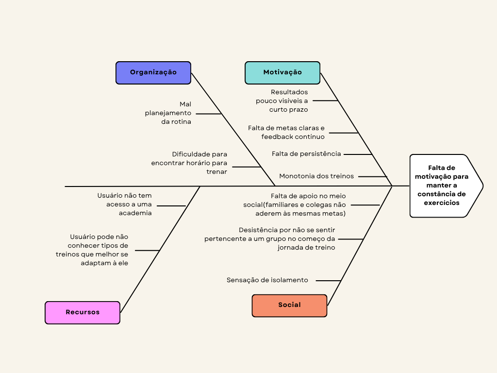

# Levantamento

## Objetivo
O Desafio:
Cada equipe vai escolher um aplicativo famoso e fazer uma engenharia reversa. Isso significa que vocês vão analisar o aplicativo de fora para dentro, entendendo por que ele foi construído daquela maneira e quais problemas ele resolve para os usuários.

---

## Entendendo o problema

---

*1.1* Aplicativo Analisado: Gymrats

*1.2* Identificação da Oportunidade ou Problema
    A falta de motivação para manter uma rotina de exercícios é um dos principais motivos que levam as pessoas a abandonarem a prática de atividades físicas. A ausência de acompanhamento, metas claras e incentivo social torna o processo solitário e desmotivador. O Gym Rats surge como uma solução para essa dor, transformando o treino em uma experiência social e competitiva. Ele estimula o engajamento por meio de desafios entre amigos, rankings e registros de progresso, criando um ambiente de suporte mútuo e competição saudável que torna o hábito de se exercitar mais divertido, consistente e recompensador.

### Diagrama de Ishikawa

---

*1.3* Público-Alvo
Grupos de Amigos: Pessoas que já possuem um vínculo social e buscam uma nova atividade para fazerem juntos, mesmo que à distância.
Equipes Corporativas: Empresas que desejam promover o bem-estar e a integração entre funcionários através de desafios fitness.
Estudantes: Grupos universitários que buscam uma maneira de aliviar o estresse e se manterem ativos com um orçamento limitado.