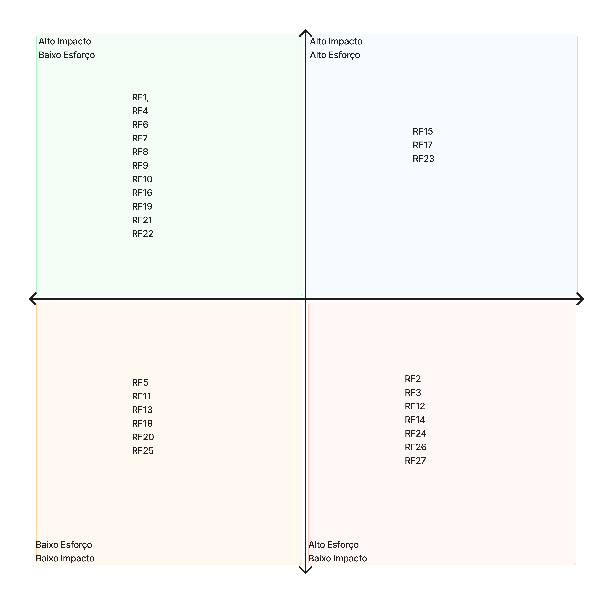

# Matriz de priorização

A Matriz de Priorização de Requisitos apresentada tem como objetivo classificar as funcionalidades do sistema de acordo com dois critérios principais: impacto e esforço de implementação. Essa análise auxilia na tomada de decisão sobre quais requisitos devem ser priorizados no desenvolvimento do projeto, equilibrando o valor entregue ao usuário com o custo e a complexidade técnica envolvidos.

A matriz é dividida em quatro quadrantes:

Alto Impacto / Baixo Esforço
Requisitos estratégicos que trazem grande valor ao sistema e são de fácil implementação.
Prioridade máxima, pois representam ganhos rápidos e relevantes.
(Ex.: RF1, RF4, RF6, RF7, RF8, RF9, RF10, RF16, RF19, RF21, RF22)

Alto Impacto / Alto Esforço
Funcionalidades de alto valor, porém com maior complexidade ou custo de implementação.
Devem ser planejadas para fases seguintes, após os itens críticos.
(Ex.: RF15, RF17, RF23)

Baixo Impacto / Baixo Esforço
Itens simples de implementar, mas com retorno limitado.
Podem ser incluídos se houver tempo ou recursos disponíveis.
(Ex.: RF5, RF11, RF13, RF18, RF20, RF25)

Baixo Impacto / Alto Esforço
Requisitos de baixa relevância e difícil execução.
Baixa prioridade, devendo ser revistos ou descartados.
(Ex.: RF2, RF3, RF12, RF14, RF24, RF26, RF27)

Essa priorização contribui para otimizar o planejamento do backlog, concentrando os esforços iniciais em entregas de alto valor com baixo custo, o que acelera a geração de resultados e a validação do produto com os usuários.

    

