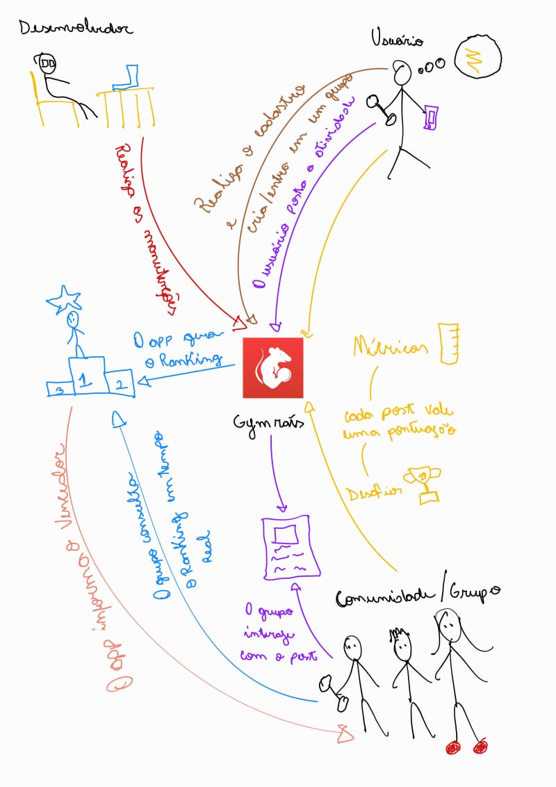

# Rich picture

O Rich Picture é uma técnica de modelagem visual usada nas etapas iniciais de um projeto para compreender e comunicar o contexto geral de um sistema.
Seu objetivo é representar, de forma não técnica e intuitiva, os atores, processos, relações, problemas e fluxos de informação que compõem o ambiente de interesse.

Diferente de diagramas formais, o Rich Picture não possui regras rígidas de notação, ele pode incluir desenhos, símbolos, textos e conexões livres, tornando-se uma ferramenta ideal para expressar ideias complexas de forma acessível.
É amplamente utilizado em análise de requisitos, levantamento de necessidades e comunicação entre as partes interessadas, servindo como ponto de partida para a compreensão do domínio do problema e a construção de soluções mais alinhadas à realidade do usuário.

    

