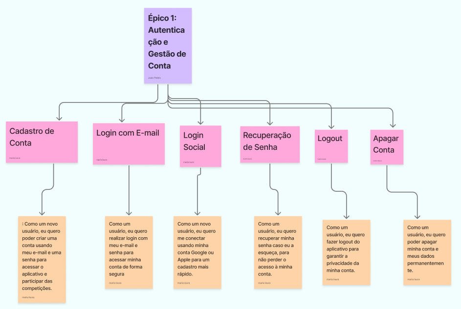
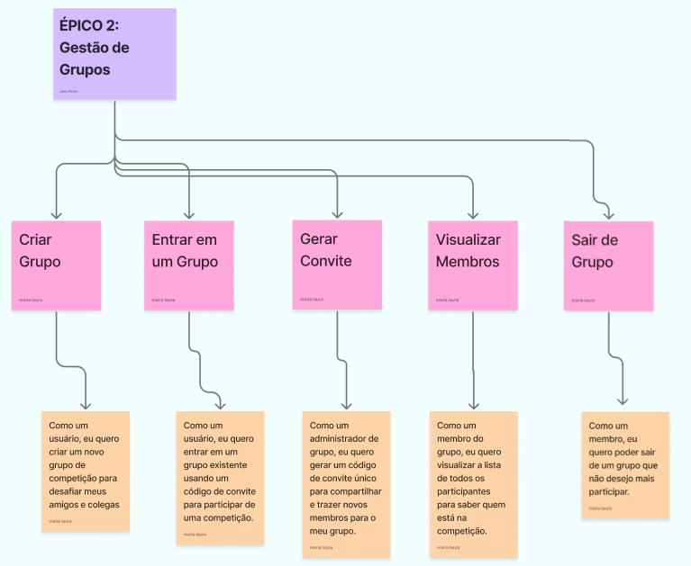
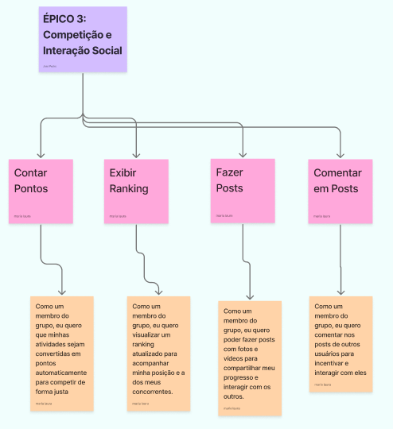
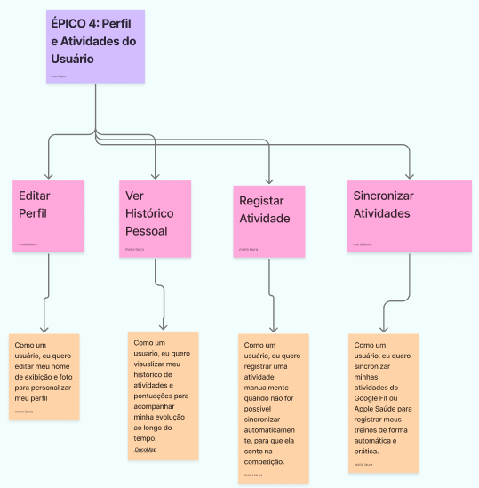

# User story Map

## Descrição

## Diagrama no figma
<iframe style="border: 1px solid rgba(0, 0, 0, 0.1);" width="800" height="450" src="https://embed.figma.com/board/P1i9uK6MLEK98yHU6NX727/Projeto-Treinee-GymRats?node-id=0-1&embed-host=share" allowfullscreen></iframe>

## Épicos

### Autenticação e gestão de conta

### Gestão de grupos

### Competição e interação social

### Perfil e atividades do usuário

