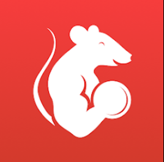

<h1 style="text-align: center;">GymRats</h1>

    

GymRats é uma plataforma que incentiva a prática de atividades físicas por meio da gamificação e interação social. Nela, os usuários podem criar e participar de grupos de competição, desafiando amigos e colegas.

O aplicativo permite o registro de treinos de forma automática (sincronizando com Google Fit e Apple Saúde) ou manual, convertendo essas atividades em pontos. Os membros do grupo podem acompanhar seu progresso em um ranking e interagir através de posts e comentários.

A proposta é tornar a jornada fitness mais envolvente e motivadora, criando uma experiência divertida e competitiva que estimula a consistência e o engajamento com um estilo de vida ativo.

## Contexto

Este repositório reúne a documentação e os artefatos criados pelo **Quarteto ternura** para o projeto do processo de trainee da Eng Net. A entrega se concentra na engenharia reversa do aplicativo gym rats.

